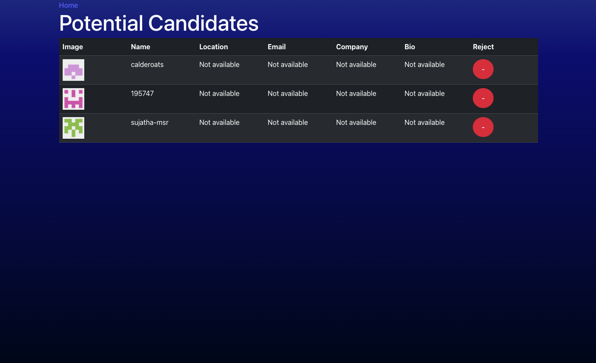

# Hub Scout 🚀

## Table of Contents
- [Overview](#overview)
- [Features](#features)
- [Technologies Used](#technologies-used)
- [Installation](#installation)
- [Usage](#usage)
- [Contributing](#contributing)
- [Contributors](#contributors)
- [Screenshot](#screenshot)
- [License](#license)
- [Questions](#questions)

## Overview

Welcome to **Hub Scout**—your go-to GitHub user search tool! This **React-powered** app lets you search for GitHub users and view their profiles in a sleek, user-friendly interface. Whether you're scouting developers or checking out cool projects, Hub Scout makes it easy!

## Features ✨

- 🔍 **Search GitHub Users** – Find users by entering a username or search term.
- 📜 **View User Details** – See profile info like avatar, username, bio, and stats.
- 📱 **Responsive Design** – Works smoothly on desktop and mobile.
- ⚠️ **Error Handling** – Get clear messages when a search fails (e.g., rate limits, no results).

## Technologies Used 🛠️

- **Frontend:** React, TypeScript, React Router
- **API:** GitHub REST API
- **Styling:** Bootstrap (with custom tweaks), CSS
- **Build Tools:** Vite

## Installation 🚀

### Prerequisites
- Install **Node.js** and **npm**
- Generate a **GitHub Personal Access Token** (with read-only access to public data)

### Steps

1. **Clone the Repository:**
   ```bash
   git clone https://github.com/yourusername/github-user-search.git
   cd github-user-search
   ```
2. **Install Dependencies:**
   ```bash
   npm install
   ```
3. **Setup Environment Variables:**
   ```bash
   VITE_GITHUB_TOKEN=your_github_token_here
   ```
4. **Run the Application:**
   ```bash
   npm run dev
   ```
5. **Build the Application:**
   ```bash
   npm run build
   ```

## Usage 🎯

1. Open your browser and navigate to [http://localhost:5173](http://localhost:5173).
2. Enter a GitHub username in the search bar.
3. Click **Search** to display the user's GitHub profile.

## Contributing 🤝

We love contributions! Here’s how you can help:

1. **Fork the Repository**
2. **Create a New Branch:**
   ```bash
   git checkout -b feature-branch
   ```
3. **Make Your Changes**
4. **Commit Your Changes:**
   ```bash
   git commit -m "Add new feature"
   ```
5. **Push to the Branch:**
   ```bash
   git push origin feature-branch
   ```
6. **Create a Pull Request**

## Contributors 🌟

Meet the awesome people who helped build this project:

- **Justin Moore**
- **Chris Baird**
- **Martha Watson** ([GitHub: Elementary-my-dear-Watson](https://github.com/Elementary-my-dear-Watson))

## Screenshot 🖼️




## License 📜

This project is licensed under the **MIT License**.

## Questions? 🤔

If you have any questions, feel free to reach out:

- **GitHub:** [jakestair](https://github.com/jakestair)
- **Email:** jacob.watson00@yahoo.com

